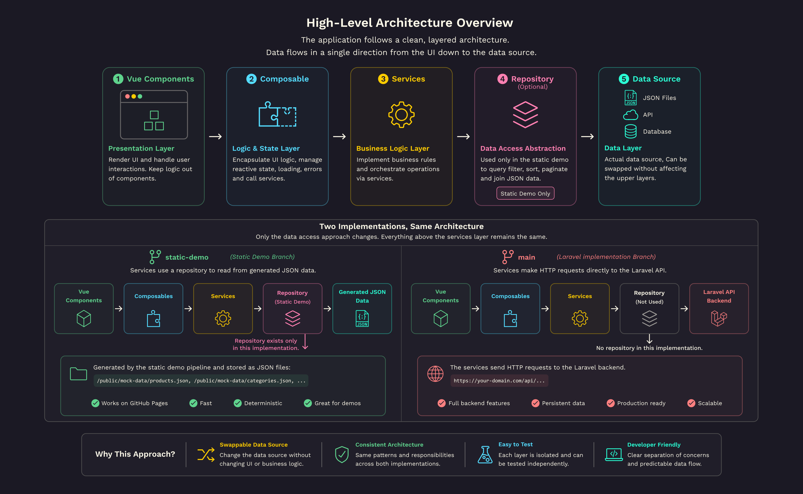
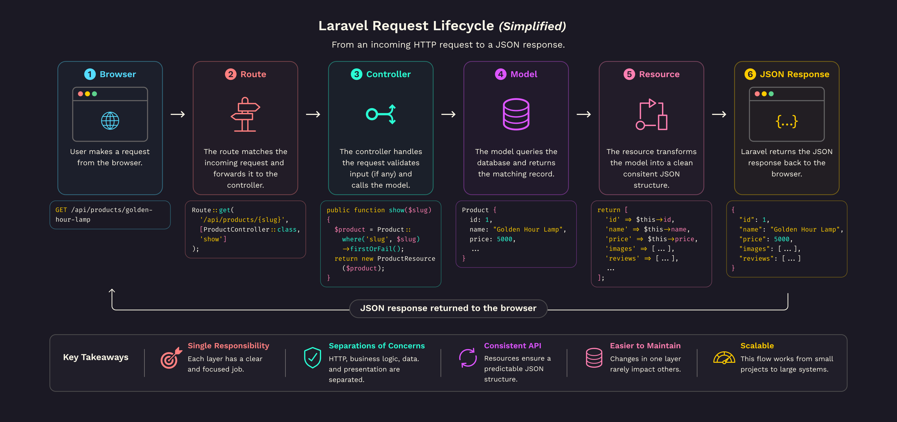
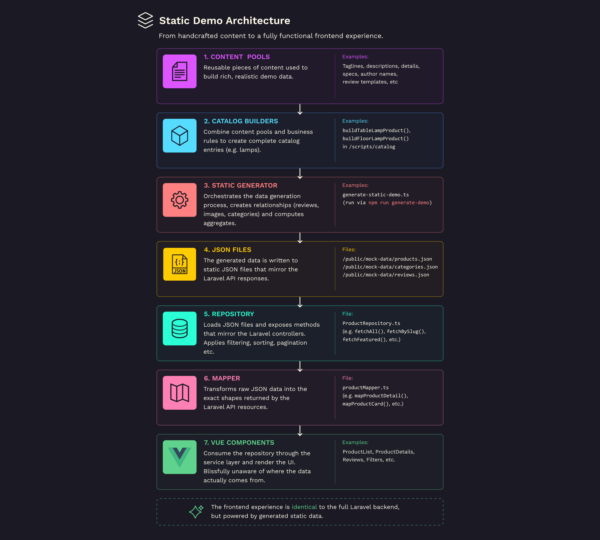
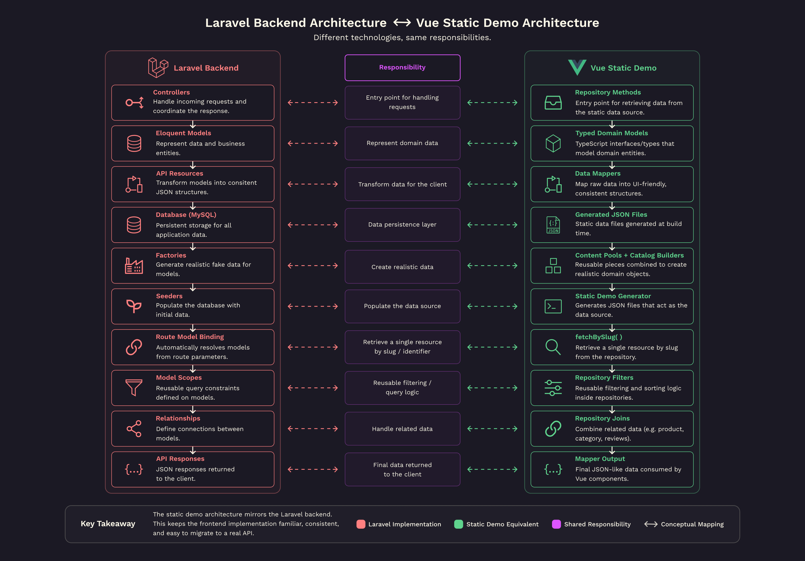

######

[🏠 Home](./README.md) &nbsp; &bullet; &nbsp;
[**The Architecture**](./README-2-the-architecture.md) &nbsp; &bullet; &nbsp;
[The Static Demo Pipeline](./README-3-the-static-demo-pipeline.md) &nbsp; &bullet; &nbsp;
[Following a Product Through the Pipeline](./README-4-follow-a-product.md) &nbsp; &bullet; &nbsp;
[Development Journey](./README-5-development-journey.md) &nbsp; &bullet; &nbsp;
[Roadmap & Author](./README-6-roadmap-and-author.md)

<br>

# 🏭 The Architecture

### 📖 Table of Contents

- In this file, [The Architecture](#🏭-the-architecture):
  - [Backend Architecture](#⚙-backend-architecture)
  - [Static Demo Architecture](#⚡-static-demo-architecture)
  - [Data Flow](#🗂-data-flow)
  - [Laravel ↔ Vue Comparison](#🔄-laravel-↔-vue-comparison)

<br>

As Lantern Loft grew, I found myself spending less time thinking about individual pages and more time thinking about how different parts of the application should communicate with one another.

One of the goals I established early on was to keep the user interface independent from the data source powering it.

This principle shaped nearly every architectural decision throughout the project.

Instead of tightly coupling components to HTTP requests or JSON files, I introduced several abstraction layers that separate responsibilities and keep the application flexible, maintainable, and easy to evolve over time.

At a high level, the application follows this flow:



<br>

## Design Principles

Some of the principles that guided this architecture include:

- Separation of concerns
- Strong typing throughout the application
- Reusable business logic
- Single responsibility
- Data-source independence
- Predictable API contracts
- Replacing implementations without affecting the UI

These principles helped ensure that individual layers of the application remain focused on one responsibility while communicating through well-defined interfaces.

<br>

---

# ⚙ Backend Architecture

Rather than treating the backend as "just somewhere data comes from", I wanted it to become an opportunity to understand how real-world applications organise business logic.

The backend follows a fairly traditional Laravel architecture built around:

- Models
- Controllers
- Resource Classes
- Traits
- Eloquent Relationships
- Query Scopes
- Database Migrations
- Seeders
- Factories

Each layer has a clearly defined responsibility.

For example:

- Controllers coordinate requests.
- Models represent domain entities.
- Resources shape API responses.
- Traits encapsulate reusable behaviour.
- Relationships define how models interact.
- Query scopes keep filtering logic reusable.

Rather than exposing raw database records directly to the frontend, every API response is transformed into a predictable shape before leaving the server.

This approach keeps the frontend isolated from database implementation details while making future backend changes significantly easier.



_Image showing a simplified **Laravel Request Lifecycle**._

<br>

## Why mirror the backend?

Once the frontend became large enough, I realised something interesting.

If the Vue application depended directly on API responses, GitHub Pages would never be able to demonstrate the project properly because PHP cannot be executed on static hosting.

Instead of building a separate "demo version", I decided to mirror many of the backend concepts inside the frontend itself.

That decision eventually became one of my favourite parts of the project.

<br>

---

# ⚡ Static Demo Architecture

One of the biggest engineering challenges of this project was finding a way to deploy a convincing demonstration without sacrificing the application's architecture.

GitHub Pages can host static assets, but it cannot run Laravel or connect to a local database.

Rather than replacing API calls with hardcoded objects, I wanted the frontend to behave as though a backend still existed.

To achieve this, I built a complete static data pipeline.

Instead of querying a live database, the application loads generated JSON files that closely resemble database tables.

Those files are then passed through the same architectural layers the real application uses before finally reaching the UI.

The result is a frontend that behaves almost identically regardless of whether its data comes from Laravel or generated mock data.



_Image showing an overview of the **Static Demo Architecture**._

<br>

## Why not hardcode JSON?

While hardcoding arrays inside the application would certainly have been simpler, it would also have tightly coupled the UI to the mock data.

Instead, the generated JSON behaves much more like a database.

The repository performs:

- filtering
- sorting
- pagination
- lookups
- joins
- searching

before returning typed objects to the rest of the application.

This keeps components almost completely unaware that the backend has been replaced.

<br>

---

# 🗂 Data Flow

One of the architectural decisions that had the greatest impact on the project was introducing a Service layer.

Rather than allowing Vue components to fetch data directly, every request passes through an API Service responsible for retrieving and preparing domain data.

Instead of this:

```text
Component
    ↓
fetch(...)
```

the application follows this structure:

```text
Component
    ↓
Composable
    ↓
Service
    ↓
Data Source
```

Each layer has a dedicated responsibility.

### Components

Responsible only for rendering the user interface.

They never know where data originates.

### Composables

Coordinate page-specific behaviour and reusable UI logic.

### Services

Provide application-level functionality and expose methods used throughout the frontend.

### Data Sources

Today the project has two implementations:

- Laravel API (`main` branch)
- Generated JSON (`static-demo` branch)

Future implementations could include:

- Firebase
- GraphQL
- Another REST API

The rest of the application would require little or no modification.

<br>

## Benefits

Using composables and services introduced several advantages:

- Components remain extremely small.
- Business logic lives in one place.
- Switching data sources becomes trivial.
- API contracts stay consistent.

<br>

---

# 🔄 Laravel ↔ Vue Comparison

One of my favourite aspects of this project is how closely the frontend mirrors concepts found in Laravel.

Rather than inventing completely different solutions for the static demo, I chose to recreate familiar backend abstractions wherever possible.

The result is an architecture that feels remarkably similar regardless of whether the application is running against Laravel or generated JSON.



_Image showing a comparison of the **Laravel Backend** and the **Vue Static Demo** architecture._

<br>

## Mirroring API Resources

Laravel uses Resource classes to transform models into predictable JSON responses.

The static implementation follows a similar philosophy through dedicated mapper functions that shape mock data before it reaches the UI.

This ensures that components always receive the same structure regardless of where the data originated.

<br>

## Shared Design Philosophy

Although Laravel and Vue solve different problems, many architectural principles translate surprisingly well between them.

Throughout the project I tried to maintain consistency wherever possible.

Concepts such as:

- separation of concerns
- reusable abstractions
- predictable interfaces
- layered architecture
- transformation before presentation

exist throughout both implementations.

This consistency has made the project significantly easier to maintain as it has grown.

<br>
<br>

## Looking Ahead

The architecture was intentionally designed so that the static implementation is only one possible data source.

When the Laravel backend is deployed, the goal is for the majority of the frontend—including components, composables, and stores—to remain unchanged.

Only the data source implementation in the service layer should need to switch.

In many ways, the static demo became more than a workaround for GitHub Pages.

It became a valuable exercise in designing software that is resilient to change.

<br>

---

<br>

[&UpArrow; Back to top](#) &nbsp; &bullet; &nbsp;
Up Next: [Part 3: The Static Demo Pipeline](./README-3-the-static-demo-pipeline.md)
