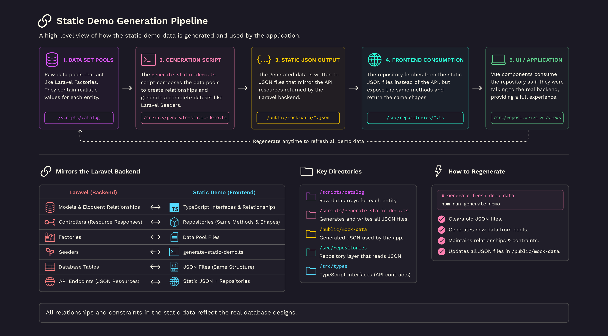
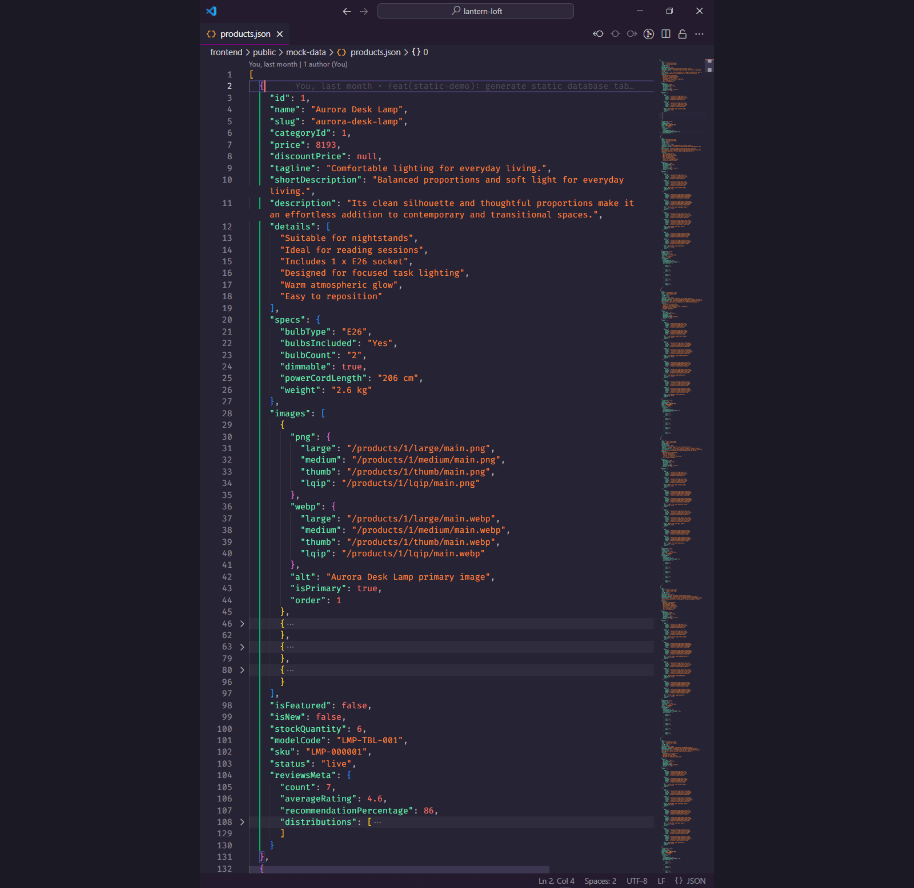
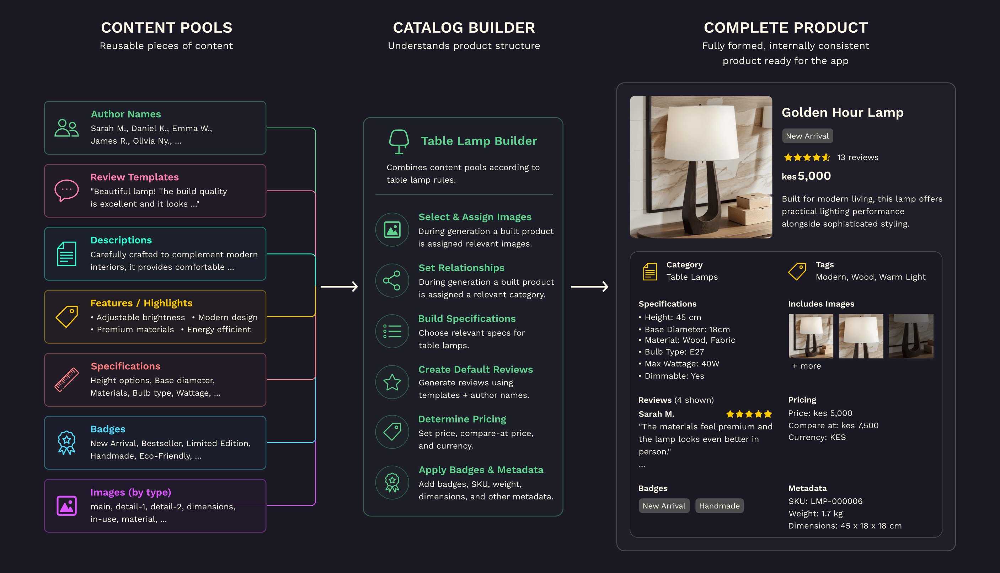
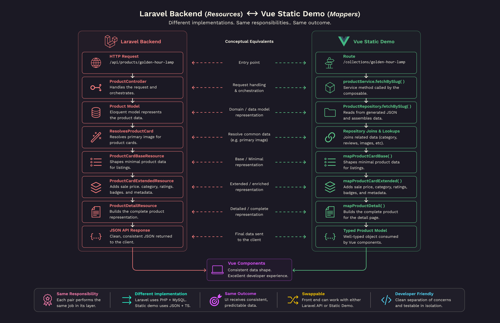

[🏠 Home](./README.md) &nbsp; &bullet; &nbsp;
[The Architecture](./README-2-the-architecture.md) &nbsp; &bullet; &nbsp;
[**The Static Demo Pipeline**](./README-3-the-static-demo-pipeline.md) &nbsp; &bullet; &nbsp;
[Following a Product Through the Pipeline](./README-4-follow-a-product.md) &nbsp; &bullet; &nbsp;
[Development Journey](./README-5-development-journey.md) &nbsp; &bullet; &nbsp;
[Roadmap & Author](./README-6-roadmap-and-author.md)

<br>

# The Static Demo Pipeline ⚡

### Table of Contents 📖

- In this file, [The Static Demo Pipeline](#the-static-demo-pipeline-):
  - [Data Generation](#data-generation-)
  - [Content Pools](#content-pools-)
  - [Catalog Builders](#catalog-builders-)
  - [Static Demo Generator](#static-demo-generator-)
  - [Generated Database](#generated-database-)
  - [The Repository](#the-repository-)
  - [Mappers](#mappers-)
  - [Strongly Typed Models](#strongly-typed-models-)
  - [Services](#services-)
  - [Composables](#composables-)
  - [Lazy Loading and Image Strategy](#lazy-loading-and-image-strategy-)
  - [Keeping the UI Data-Source Agnostic](#keeping-the-ui-data-source-agnostic-)
  - [Adding a New Product](#adding-a-new-product-)
  - [Final Thoughts](#final-thoughts-)

<br>



_Image showing an overview of the **Static Demo Generation Pipeline**._

<br>

One of the most interesting parts of this project isn't visible when using the application.

It's the system responsible for making the application behave as though it's communicating with a live Laravel backend—even though it's running entirely on GitHub Pages.

Instead of treating the static demo as a temporary workaround, I approached it as an architectural challenge.

The goal wasn't simply to "make the UI work."

The goal was to preserve as much of the real application's architecture as possible while replacing only the underlying data source.

This eventually grew into a complete static data pipeline consisting of generators, content pools, repositories, mappers, typed models, and services that work together to simulate many behaviours of a real backend.


_Image showing an overview of the **Static Demo Architecture**._

<br>

---

# Data Generation 🎲

Unlike traditional mock data that is manually written into JSON files, Lantern Loft generates its demo data programmatically.

Running:

```bash
npm run generate-demo
```

executes the static generator responsible for assembling the application's entire mock database.

The generated output includes data such as:

- Products
- Categories
- Reviews
- Authors
- Images
- Specifications
- Product details

Rather than maintaining large JSON files by hand, the generator combines reusable content with predefined rules to create realistic catalogue entries.

This approach provides several advantages:

- easier maintenance
- consistent formatting
- reusable data
- repeatable generation
- scalable catalogue creation

It also mirrors how Laravel Factories and Seeders generate development databases.



_Image showing a screenshot of the generated `products.json` file._

<br>

---

# Content Pools 🧩

At the heart of the generator are reusable content pools.

Instead of hardcoding complete products, the application stores small pieces of reusable information that can be combined in different ways.

Examples include:

- Author names
- Review templates
- Product taglines
- Product descriptions
- Specifications
- Product highlights

Rather than thinking of these as static JSON snippets, they're better viewed as building blocks.

Every time the generator runs, these pieces are assembled into complete products.

This approach keeps the content consistent while dramatically reducing duplication throughout the project.

<br>

## Why not manually write JSON?

Manually maintaining dozens—or eventually hundreds—of products would quickly become repetitive.

More importantly, every product would require duplicated information.

Instead, each product is assembled from reusable datasets.

This means adding new products involves adding only the information unique to that product while allowing the generator to populate everything else automatically.

The result is a catalogue that's significantly easier to maintain.

<br>

---

# Catalog Builders 🏭

Content pools alone aren't enough to generate meaningful products.

Catalog builders are responsible for combining reusable content into complete domain objects.

Rather than simply selecting random values, builders understand the structure of each product category.

For example, they determine:

- specifications
- default reviews
- pricing
- badges
- metadata

This allows every generated product to remain internally consistent while still benefiting from reusable content.



_Image showing multiple content pools merging into one product._

<br>

---

# Static Demo Generator ⚙

The generator acts as the entry point to the entire pipeline.

Running:

```bash
npm run generate-demo
```

invokes:

```text
scripts/generate-static-demo.ts
```

which orchestrates the complete generation process.

At a high level, the generator:

1. Loads catalog builders.
2. Generates product data.
3. Generates reviews.
4. Generates categories.
5. Resolves relationships.
6. Writes JSON files to disk.

Rather than manually exporting JSON files, everything is regenerated from source data whenever changes are made.

This makes the generated files disposable artifacts rather than manually maintained assets.

<br>

---

# Generated Database 🗃

Once generation completes, the application has what is effectively a miniature database.

```text
public/
 ┣ 📂 mock-data/
 ┃  ┣ categories.json
 ┃  ┣ products.json
 ┃  ┣ reviews.json
```

These files behave much like database tables.

Relationships between entities are preserved, allowing repositories to perform operations similar to those found in the Laravel backend.

The frontend never interacts with these files directly.

Instead, all access goes through the repository.

<br>

---

# The Repository 📚

```
frontend/src/repositories/ProductRepository.ts
```

The repository acts as the application's data access layer.

Rather than allowing components to read the JSON files directly, the repository encapsulates every operation involving product data.

Typical responsibilities include:

- retrieving collections
- retrieving a single product
- filtering
- sorting
- pagination
- related products

This keeps data access centralised and prevents business logic from leaking into UI components.


_Image showing a comparison of the **Static Demo** and **Laravel** implementations of the app._

<br>

## Why this matters

Because every request passes through services, switching data sources becomes remarkably simple.

Today the application reads generated JSON through the repository.

Tomorrow it could call Laravel without requiring the UI to change.

<br>

---

# Mappers 🔄

The repository intentionally returns raw domain models.

Before data reaches the user interface, it passes through dedicated mapper functions.

These mappers are responsible for shaping data into the format expected by Vue components.

Responsibilities include:

- formatting image URLs
- resolving preview images
- flattening nested objects
- calculating derived values
- exposing only relevant fields

This mirrors Laravel's Resource classes, where models are transformed before becoming API responses.

The result is a clean separation between storage models and presentation models.



_Image showing a comparison of **Laravel API Resources** and **Static Demo Mappers**._

<br>

---

# Strongly Typed Models 🧠

One of the major goals of the static implementation was preserving the same level of type safety expected from a real backend.

Rather than passing around loosely structured objects, every layer communicates using well-defined TypeScript models.

These models describe:

- Products
- Categories
- Reviews
- Images
- Specifications
- API responses

Having explicit types throughout the application improves:

- autocomplete
- refactoring
- maintainability
- compile-time validation
- developer confidence

As the project grew, these shared models became one of the most valuable parts of the codebase.

<br>

---

# Services 🧱

Services provide a thin abstraction layer between the data source and the rest of the application.

Instead of components interacting with the data source directly, services expose higher-level application functionality.

Examples include:

- fetching products
- fetching recommendations
- retrieving categories
- retrieving featured products

For the static demo implementation, services point to the repository methods whereas in the Laravel implementation, they are concerned with making requests directly to the backend API

<br>

---

# Composables 🧩

Vue composables are responsible for coordinating page behaviour.

Rather than mixing asynchronous logic with rendering code, composables handle:

- loading state
- error handling
- pagination state
- route synchronisation
- filtering
- reusable fetching logic

Components remain almost entirely concerned with presentation.

This separation significantly improves readability while making page behaviour easier to reuse across the application.

<br>

---

# Lazy Loading and Image Strategy ⏳

Images make up the majority of an ecommerce application's payload.

To improve perceived performance, product images are loaded progressively throughout the application.

This includes techniques such as:

- lazy loading
- low-quality image placeholders (LQIP)
- progressive image loading
- deferred fetching for non-critical content

Rather than loading every image immediately, assets are only requested when they become necessary.

This keeps initial page loads lightweight while maintaining a smooth browsing experience.

<br>

---

# Keeping the UI Data-Source Agnostic 🔐

Perhaps the most important outcome of the static architecture is something users never notice.

The UI has no knowledge of where its data comes from.

Whether products originate from:

- generated JSON
- Laravel
- another backend

the interface remains unchanged.

Every component communicates only with application services.

This keeps the frontend resilient to future backend changes while allowing different implementations to be swapped with minimal effort.

<br>

---

# Adding a New Product 🚀

One of the biggest advantages of this architecture is how little work is required to expand the catalogue.

Rather than manually editing multiple JSON files, adding a new product typically follows this workflow:

1. Add product assets.
2. Create or update the catalog builder.
3. Reference reusable content pools.
4. Run the static generator.
5. Launch the application.

The generator takes care of producing the necessary JSON while repositories and mappers automatically expose the new product throughout the application.

<br>
<br>

---

# Final Thoughts 💭

What began as a workaround for GitHub Pages ultimately became one of the most educational parts of the project.

Designing a frontend capable of faithfully simulating a Laravel backend required thinking beyond components and pages.

It challenged me to consider topics such as abstraction, data modelling, transformation pipelines, maintainability, type safety, and separation of concerns.

More importantly, it reinforced a lesson that has shaped the rest of this project:

> Good software architecture isn't about the technologies being used—it's about designing systems that can adapt to change with as little friction as possible.

The static demo is a direct reflection of that philosophy.

<br>

---

<br>

[&UpArrow; Back to top](#the-static-demo-pipeline) &nbsp; &bullet; &nbsp;
Up Next: [Part 4: Following a Product Through the Pipeline](./README-4-follow-a-product.md)
