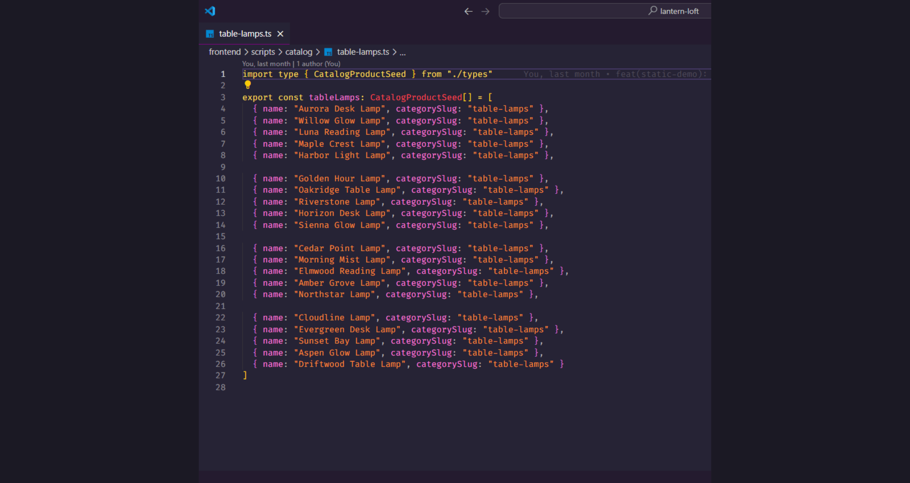
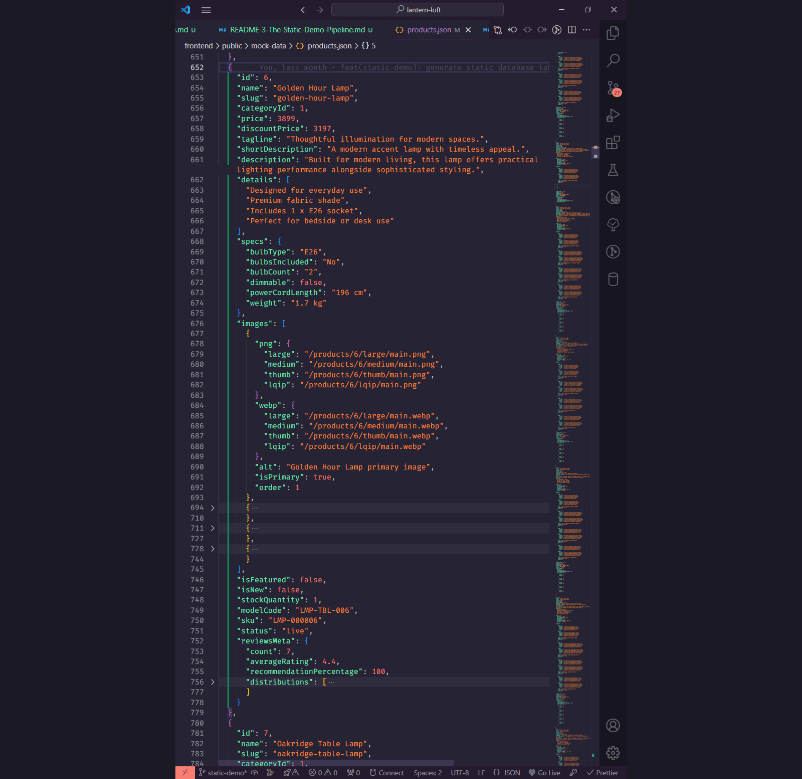
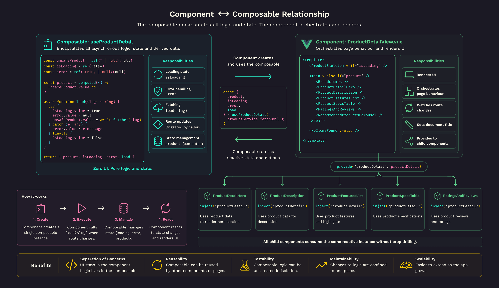

[🏠 Home](./README.md) &nbsp; &bullet; &nbsp;
[The Architecture](./README-2-the-architecture.md) &nbsp; &bullet; &nbsp;
[The Static Demo Pipeline](./README-3-the-static-demo-pipeline.md) &nbsp; &bullet; &nbsp;
[**Following a Product Through the Pipeline**](./README-4-follow-a-product.md) &nbsp; &bullet; &nbsp;
[Development Journey](./README-5-development-journey.md) &nbsp; &bullet; &nbsp;
[Roadmap & Author](./README-6-roadmap-and-author.md)

<br>

# Following a Product Through the Entire Pipeline 📦

### Table of Contents 📖

- In this file, [Following a Product Through the Entire Pipeline](#following-a-product-through-the-entire-pipeline-):
  - [1. Defining the Product](#1-defining-the-product)
  - [2. Enriching the Product](#2-enriching-the-product)
  - [3. Generating the Static Database](#3-generating-the-static-database)
  - [4. Retrieving the Product](#4-retrieving-the-product)
  - [5. Transforming the Product](#5-transforming-the-product)
  - [6. Exposing the Product](#6-exposing-the-product)
  - [7. Coordinating the Page](#7-coordinating-the-page)
  - [8. Rendering the UI](#8-rendering-the-ui)
  - [Why This Matters](#why-this-matters)

<br>

Architecture diagrams are useful, but they can sometimes feel abstract.

To make the static demo architecture a little more tangible, let's follow a single product as it travels through the application.

For this example, we'll use the **Golden Hour Table Lamp**.

Rather than magically appearing on the Product Details page, the lamp passes through several independent layers before finally being rendered in the browser.

Let's walk through each stage.

<br>

## 1. Defining the Product

Every product begins its journey inside one of the catalog builders.

For the Golden Hour Lamp, that means something similar to:

```text
scripts/
 ┣ 📂 catalog/
 ┃  ┣ table-lamps.ts
```

This file contains the product-specific information that makes Golden Hour unique which in this case is the product name.

Rather than containing every possible field, the builder references reusable content pools wherever possible.

This keeps each product concise while avoiding unnecessary duplication.



_Image showing screenshot of product definitions inside `scripts/catalog/table-lamps.ts`._

<br>

## 2. Enriching the Product

The product definition alone isn't enough to build a complete catalogue entry.

During generation, reusable content is merged into the product from several content pools.

Examples include:

- review authors
- review templates
- marketing copy
- feature highlights
- image metadata

Instead of manually repeating these across every product, they are assembled automatically during generation.

This approach keeps the catalogue consistent while making it much easier to expand over time.


_Image showing multiple content pools merging into one product._

<br>

## 3. Generating the Static Database

Once every product has been assembled, the static generator is executed.

```bash
npm run generate-demo
```

This runs:

```text
scripts/generate-static-demo.ts
```

which orchestrates the entire generation process.

Among its responsibilities are:

- loading catalog builders
- generating products
- generating reviews
- resolving relationships
- writing JSON files

When the generator completes, Golden Hour has become part of the application's generated database.

```text
public/
 ┣ 📂 mock-data/
 ┃  ┣ products.json
```

At this stage, the product exists only as raw data.

No Vue components have interacted with it yet.



_Image showing a screenshot of the generated `products.json` file highlighting the entry for the **Golden Hour Lamp**._

<br>

## 4. Retrieving the Product

Suppose a user navigates to:

```text
/collections/golden-hour-lamp
```

Rather than reading directly from `products.json`, the request passes through the service layer.

Conceptually, the flow looks like this:

```text
productService.fetchBySlug("golden-hour-lamp")
```

The service then points to the repository method responsible for locating the correct product and performing any additional work required before it can be returned.

This may include:

- validating the slug
- resolving image collections
- attaching reviews

The repository acts much like a Laravel controller querying the database.

The UI still has no idea where the data came from.

<br>

## 5. Transforming the Product

The repository intentionally returns domain data rather than UI-ready objects.

Before Golden Hour reaches the frontend, it passes through a mapper.

```text
productMapper()
```

The mapper reshapes the product into the structure expected by Vue components.

Typical responsibilities include:

- resolving preview images
- exposing only required fields
- flattening nested structures
- formatting image collections
- computing derived properties

This closely mirrors Laravel API Resources, where Eloquent models are transformed before becoming JSON responses.

The benefit is that components always receive a predictable structure regardless of how the data is stored internally.


_Image showing a comparison of **Laravel Resources** and **Static Demo Mappers**._

<br>

## 6. Exposing the Product

After transformation, the mapped product is returned through the service layer.

Instead of components calling the repository directly, they interact with the service layer.

Conceptually:

```text
productService.fetchBySlug()
```

This keeps components free from data-access concerns and provides a consistent API for the rest of the application.

If the repository implementation changes in the future, the service interface can remain largely unchanged.

<br>

## 7. Coordinating the Page

Inside the Product Details page, a Vue composable is responsible for orchestrating page behaviour.

Rather than placing asynchronous logic inside the component itself, the composable handles:

- loading state
- error handling
- fetching
- route updates
- state management

The component simply consumes the data it receives.

Conceptually:

```text
const {
    product,
    loading,
    error
} = useProductDetail()
```

This keeps presentation and business logic nicely separated.



_Image showing the relationship between **Components** and **Composables**._

<br>

## 8. Rendering the UI

Finally, the mapped product reaches the Vue component responsible for rendering the page.

At this point, the component doesn't know:

- whether the data came from Laravel
- whether it came from generated JSON
- how it was transformed
- where it was stored

It simply receives a strongly typed product object and renders it.

This was one of the primary architectural goals of the project.

By the time data reaches the UI, every previous layer has already done the work necessary to prepare it.

<br>

---

# Why This Matters

Following a single product through the application demonstrates an important design principle for both the Laravel and static demo implementations:

> Every layer has one clearly defined responsibility.

The catalog builders define products (equivalent to Laravel's Factories & Seeders).

The generator creates the database (equivalent to Laravel's Database layer).

Repositories retrieve data (equivalent to Laravel Controllers).

Mappers transform data (equivalent to Laravel Resources).

Services expose business operations.

Composables coordinate page behaviour.

Components render the interface.

Because these responsibilities remain independent, the application becomes significantly easier to maintain, test, and extend.

Perhaps most importantly, replacing the static implementation with the real Laravel backend requires surprisingly few changes.

The only layer that needs to change is the service layer itself—switching out the repository for a backend API.

Everything above it can remain exactly the same.

<br>

---

<br>

[&UpArrow; Back to top](#following-a-product-through-the-entire-pipeline-) &nbsp; &bullet; &nbsp;
Up Next: [Part 5: Development Journey](./README-5-development-journey.md)
