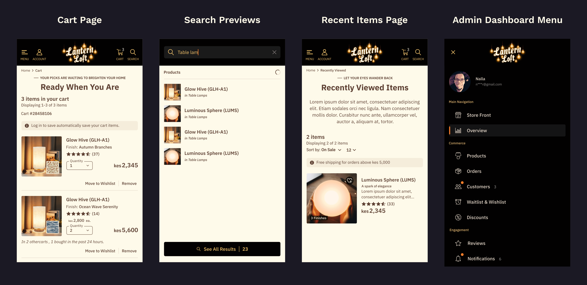

[🏠 Home](./README.md) &nbsp; &bullet; &nbsp;
[The Architecture](./README-2-the-architecture.md) &nbsp; &bullet; &nbsp;
[The Static Demo Pipeline](./README-3-the-static-demo-pipeline.md) &nbsp; &bullet; &nbsp;
[Following a Product Through the Pipeline](./README-4-follow-a-product.md) &nbsp; &bullet; &nbsp;
[Development Journey](./README-5-development-journey.md) &nbsp; &bullet; &nbsp;
[**Roadmap & Author**](./README-6-roadmap-and-author.md)

 

# Roadmap 🛣

### Table of Contents 📖

- In this file:
  - [Roadmap](#roadmap-)
  - [Useful Resources](#useful-resources-)
  - [Acknowledgements](#acknowledgements-)
  - [Author](#author-)

 

Although Lantern Loft already includes a functional frontend and a comprehensive static demo architecture, it is still very much a work in progress.

The long-term vision is to build a complete ecommerce platform backed by Laravel while preserving the architecture described throughout this README.

The roadmap below outlines the major milestones planned for the project.

 

## ✅ Phase 1 — Foundation _(Completed)_

The first phase focused on building a solid architectural foundation that future features could build upon.

Completed work includes:

- Landing page
- Product listing (collections)
- Product details page
- Authentication UI
- Responsive layouts
- Product filtering
- Product sorting
- Pagination
- Product recommendations
- Lazy image loading
- Low-quality image placeholders (LQIP)
- Static demo architecture
- Type-safe domain models
- Static data generation pipeline
- Toast notifications

 

## 🚧 Phase 2 — Shopping Experience

The next milestone focuses on transforming the application from a product catalogue into a functional shopping experience.

Planned features include:

- Shopping cart
- Wishlist
- Recently viewed products
- Product search
- Coupon support
- Shipping estimator
- Mini cart
- Product comparison
- Improved accessibility and SEO

 

## 🛒 Phase 3 — Checkout

Once the shopping experience is complete, the next focus will be implementing a realistic checkout flow.

Planned work includes:

- Checkout process
- Shipping addresses
- Billing addresses
- Payment flow
- Order confirmation
- Email templates
- Order summaries
- Tax calculations

 

## 👤 Phase 4 — Customer Dashboard

This phase focuses on authenticated user functionality.

Planned features include:

- User profile
- Order history
- Wishlist management
- Saved addresses
- Password management
- Notification preferences
- Account settings

 

## ⚙ Phase 5 — Admin Dashboard

The admin dashboard is intended to become a complete management interface for the ecommerce platform.

Planned features include:

- Dashboard analytics
- Product management
- Category management
- Order management
- Customer management
- Review moderation
- Inventory management
- Coupon management
- Media library
- Settings

 

## 🚀 Phase 6 — Laravel Backend

Although GitHub Pages only showcases the static demo frontend, the long-term goal is to deploy the Laravel implementation of the application to a hosted server and showcase a fully featured Laravel backend.

Areas of focus include:

- REST API
- Authentication
- Authorization
- Database persistence
- File uploads
- Form Requests
- Policies
- Queues
- Events
- Notifications
- Email verification

 

## 🌟 Future Ideas

Beyond the core ecommerce experience, there are several ideas I'd love to explore in future iterations.

Some possibilities include:

- Product personalization
- Recently viewed history
- AI-powered product recommendations
- Customer reviews with images
- Product bundles
- Dark mode
- Internationalization (i18n)
- Multi-currency support
- Analytics dashboard
- Offline support
- Progressive Web App (PWA)

As with any long-term project, this roadmap will continue evolving as new ideas emerge.

 

## A Sneak Peek

_Image showing designs of some of the features still to come._

 

---

# Useful Resources 💎

- [XAMPP](https://www.apachefriends.org/) - A free, open-source, cross-platform web server solution stack developed by Apache Friends, designed to help developers create local environments for testing and debugging web applications before deploying them to live servers

- [Insomnia REST](https://insomnia.rest/) - A free, open-source, cross-platform desktop application designed as an API client for developing, testing, and debugging APIs

- [Laravel Tinker](https://github.com/laravel/tinker) - Laravel Tinker is a powerful REPL (Read-Eval-Print Loop) tool powered by PsySH that allows developers to interact with the Laravel application directly from the command line

- [Font-size clamp() Generator](https://clamp.font-size.app/) - Generate linearly scale font-size with clamp() Minimum viewport width · px · rem · Maximum viewport width · px · rem · Minimum font size · px · rem · Maximum font size

- [CSS Scan](https://getcssscan.com/css-box-shadow-examples) - 95 Beautiful CSS box-shadow examples

- [Codepen.io](https://codepen.io/team/css-tricks/pen/jOarVmy) - Link hover effects used in the app

- [Commitizen](https://commitizen-tools.github.io/commitizen/) - Commitizen is a powerful release management tool that helps teams maintain consistent and meaningful commit messages while automating version management

- [Commitlint](https://commitlint.js.org/) - Get high commit message quality and short feedback cycles by linting commit messages right when they are authored

- [Conventional Changelog](https://conventional-changelog.js.org/) - Generate a changelog from your git history — automatically, following your commit convention

- [Forge Icons](https://icons.theforgesmith.com/) - 300+ right mix of SVG icons for your project

- [SVG Repo](https://svgrepo.com) - Free SVG Vectors and Icons

- [Web AIM contrast checker](https://webaim.org/resources/contrastchecker/) - Web accessibility in mind

- [iFoto AI](https://www.ifoto.ai/) - Free online photo editor with AI tools. Effortlessly edit photos, change backgrounds and explore advanced features for creative editing!

- [Tiny PNG](https://tinypng.com/) - Free online image optimizer for faster websites! Reduce the file size of your WEBP, JPEG and PNG Images with TinyPNG’s smart lossy compression engine.

- [Tiny SEO](https://tinyseo.com/png-to-webp/) - PNG to WebP Converter by TinySEO

- [Inkscape](https://inkscape.org) - Inkscape SVG Editor is an essential tool for my web projects. I use it frequently to design and fine-tune the _spacing_, _sizing_ and _positioning_ of elements. For insight into how I integrate Inkscape into my coding workflow, check out this repository I created - [Designing and Coding Layouts](https://github.com/AllanKirui/designing-and-coding-layouts)

 

## Topics Worth Exploring

Many of the architectural ideas used throughout this project are independent of any particular framework.

Some topics I highly recommend exploring include:

- Separation of Concerns
- REST API Design
- Domain Modeling
- Resource Transformation
- Type-safe Frontend Development
- Progressive Image Loading
- Software Architecture
- Refactoring

 

---

# Acknowledgements 🙏

This project wouldn't exist without the incredible open-source community.

I'm deeply grateful to the developers, maintainers, and contributors behind the tools that made Lantern Loft possible, including:

- Laravel
- Vue
- TypeScript
- Tailwind CSS
- Pinia
- Vite
- GitHub

Their work continues to make learning, experimentation, and building software more accessible to developers around the world.

I'd also like to extend my heartfelt thanks to **[Maximilian Schwarzmüller](https://academind.com/)**, **[Manuel Lorenz](https://academind.com/)**, **[Edwin Diaz](https://edwindiaz.com/)**, **[Zura The Codeholic](https://thecodeholic.com/)**, **[Brad Traversy](https://www.traversymedia.com/)**, and **[Brad Schiff](https://learnwebcode.com/)**. Through their tutorials, courses, and educational content, they taught me the fundamentals of JavaScript, Vue, TypeScript, PHP, Laravel, and modern web development. They provided the foundation that gave me the confidence to take on increasingly ambitious projects, while encouraging me to keep learning, keep experimenting, and keep building.

Lantern Loft is a direct reflection of everything I learned from their teaching, combined with countless hours of curiosity, experimentation, problem-solving, and refinement. Their generosity in sharing knowledge has had a lasting impact on my journey as a self-taught developer.

To all of them—and to the countless educators and open-source contributors who freely share their knowledge with the world—thank you for equipping me with the skills, confidence, and inspiration to build Lantern Loft and, ultimately, to **build something amazing.**

 

---

# Author ✍🏾

Hi! I'm **Allan Kirui**.

I'm a self-taught software developer with a passion for building thoughtfully designed applications that combine clean architecture with polished user experiences.

Lantern Loft represents one of the most ambitious projects I've undertaken so far and has been an invaluable learning experience in both frontend and backend development.

While the application itself is still evolving, the lessons learned while building it have already shaped the way I approach software engineering.

If you've made it this far, thank you for taking the time to explore the project and read through its documentation.

I genuinely hope you found something useful, whether it was a design idea, an architectural decision, or simply a reminder that some of the best ways to learn are by building.

I'd love to hear your thoughts, suggestions, or feedback.

Coding is your superpower! ✌

 

## Connect with Me

> 👨‍💻 GitHub - [Allan Kirui](https://github.com/AllanKirui)

> 🌍 Website - [Allan Kirui](https://allankirui.github.io)

> 📧 Email - <allan.kirui@outlook.com>

 

## License

Copyright © 2026 Allan Kirui.

This project is publicly available for portfolio and educational purposes.

You are welcome to browse the source code and learn from the implementation, but you may not copy, redistribute, or use this project or its assets to create derivative works or commercial products without prior written permission.

All rights reserved.

 

---

 

[&UpArrow; Back to top](#roadmap-)
