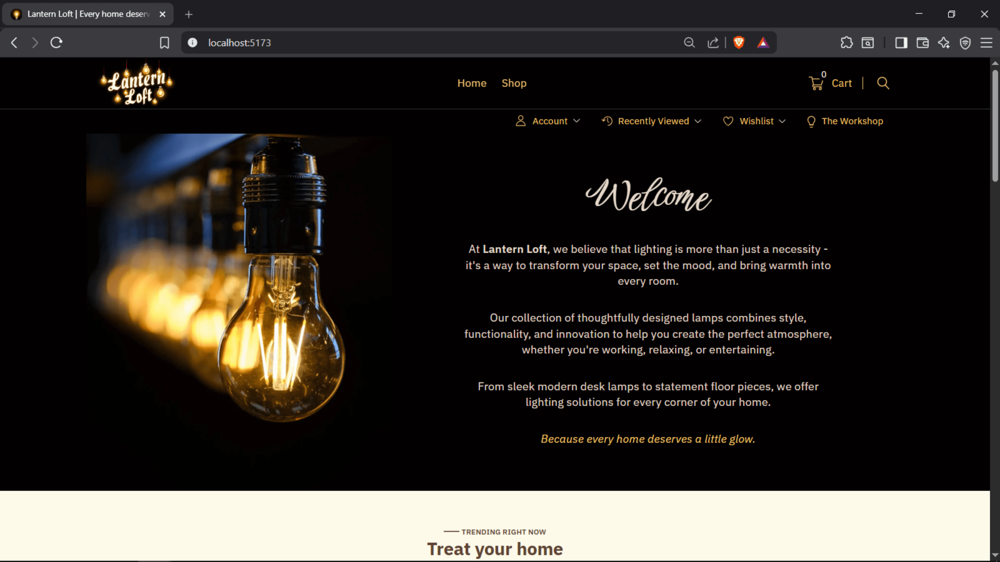
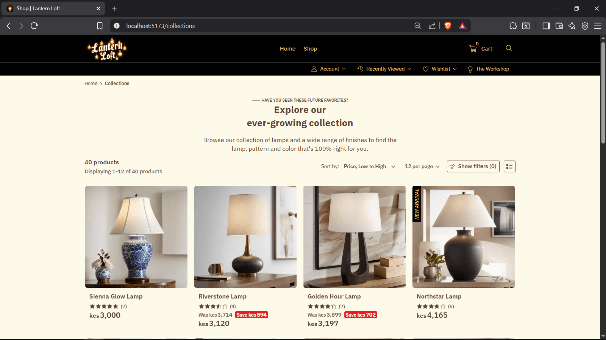
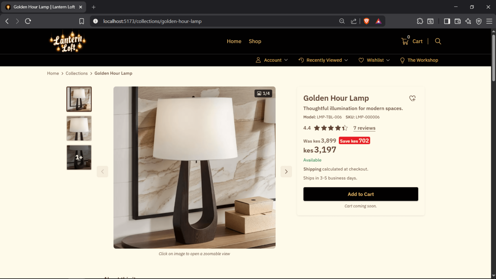
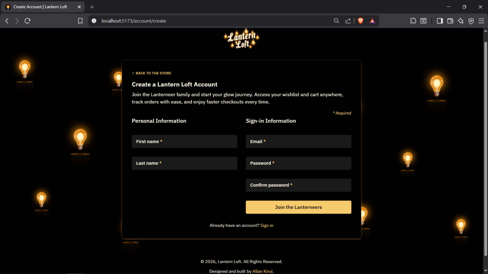
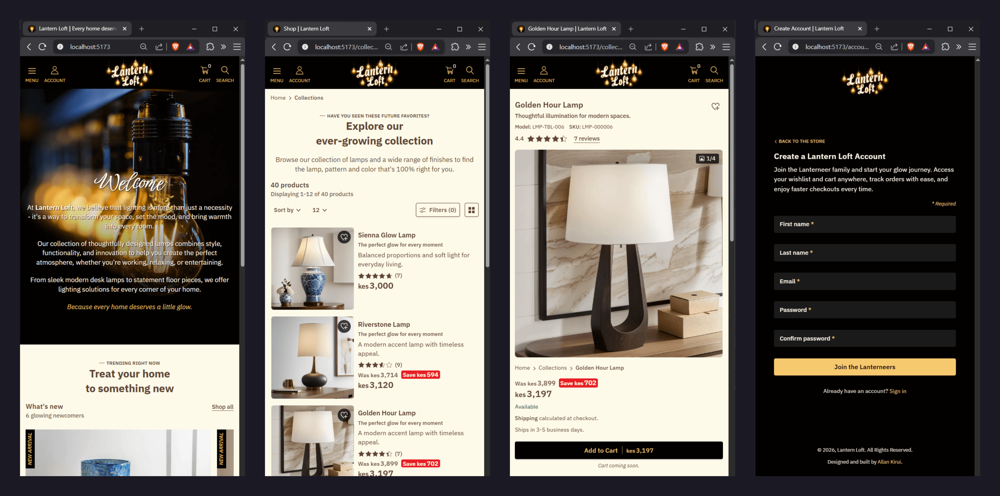

# Lantern Loft 💡


[](https://vuejs.org) &nbsp; &nbsp;
[](https://laravel.com) &nbsp; &nbsp;
[](https://www.typescriptlang.org) &nbsp; &nbsp;
[](https://tailwindcss.com) &nbsp; &nbsp;
[](https://pinia.vuejs.org) &nbsp; &nbsp;
 &nbsp; &nbsp;
 &nbsp; &nbsp;
 &nbsp; &nbsp;

> _"Build something amazing."_ — The Laravel Team

<br>

## Welcome 👋

I've always believed that the best way to learn software engineering is by building real products.

When I first started learning Laravel, I could have built another CRUD application or followed yet another tutorial. Instead, I wanted something that would challenge me to think beyond individual pages and components—something that would require designing an actual product from the ground up.

That idea eventually became **Lantern Loft (A Laravel Vue Ecommerce)**.

Lantern Loft is an ecommerce application for a fictional lighting store specializing in handcrafted table lamps and floor lamps. It began as a way to learn Laravel but gradually evolved into my most ambitious project to date, giving me the opportunity to explore both frontend and backend development while making real-world engineering and product decisions along the way.

As the project grew, so did its scope. I found myself designing REST APIs, modelling database relationships, creating reusable frontend architecture, experimenting with resource transformers, working with TypeScript, and learning how to structure an application that would remain maintainable as it scaled.

This repository showcases both the **frontend and backend application**, alongside a carefully designed **static demo architecture** that mirrors how the real Laravel backend behaves.

Because GitHub Pages cannot execute PHP, the application cannot communicate with the Laravel backend directly. Rather than settling for screenshots or videos, I wanted visitors to experience a working version of the application.

That challenge ultimately became one of the most enjoyable parts of the project.

Instead of simply replacing API calls with hardcoded JSON files, I designed a frontend architecture that closely mirrors the Laravel backend. A generated mock database, repository layer, data mappers, and strongly typed models work together to simulate how the real API behaves, allowing the Vue application to function almost exactly as it would against a live backend.

One of my primary goals when implementing the static demo was ensuring minimal rewrites to the existing frontend architecture when switching the data source from the Laravel API to static JSON data. The result was a UI that was blissfully unaware of where its data originated.

Although the project is still a work in progress, it already represents countless hours of learning, experimentation, redesigning, refactoring, and solving problems that I had never encountered before.

At the time of writing, the following parts of the application have been implemented:

- 🏠 Landing Page
- 🛍 Collections (Product Listing)
- 💡 Product Details Page
- 🔐 Authentication UI
- 📱 Responsive Layout
- ⚡ Static Demo Architecture

The remainder of the application—including shopping cart, checkout flow, customer profile, order management, wishlist, admin dashboard and the complete Laravel backend—is planned for future development.

I hope you enjoy exploring both the application **and** the engineering decisions that brought it to life.

<br>

## Project Philosophy 💭

Lantern Loft isn't an attempt to build the largest ecommerce application.

It's an attempt to build one thoughtfully.

Throughout the project I've tried to favour:

- clarity over cleverness
- maintainability over shortcuts
- consistency over one-off solutions
- iteration over perfection

Every architectural decision documented throughout this README stems from those principles.

The application will continue evolving, but I hope those ideas remain constant.

<br>

### Table of Contents 📖

- In this file, [Overview](#overview-):
  - [About the Project](#about-the-project)
  - [Project Goals](#project-goals-)
  - [Features](#features-)
  - [Screenshots](#screenshots-)
  - [Links](#links-)
  - [Quick Start](#quick-start-)
- Part 2: [The Architecture](./README-2-the-architecture.md)
- Part 3: [The Static Demo Pipeline](./README-3-the-static-demo-pipeline.md)
- Part 4: [Following a Product Through The Pipeline](./README-4-follow-a-product.md)
- Part 5: [Development Journey](./README-5-development-journey.md)
- Part 6: [Roadmap & Author](./README-6-roadmap-and-author.md)

<br>

---

# Overview 🔎

## About the Project

Lantern Loft is a modern ecommerce application built with **Vue**, **TypeScript**, **Tailwind CSS**, and **Laravel**.

Rather than focusing solely on building pages, this project explores how a real-world ecommerce application can be architected from both the frontend and backend perspectives.

The static demo's application structure has been intentionally designed around the same architectural principles used by the Laravel backend. This allowed me to continue developing, testing features, and demonstrating the application despite the hosting limitations of GitHub Pages.

Instead of viewing the static demo as a compromise, I chose to treat it as an engineering challenge in its own right.

The result is a frontend capable of simulating many backend behaviors—including filtering, pagination, sorting, API resource transformations, and generated mock data—without requiring a running PHP server.

<br>

## Project Goals 🎯

This project was designed to help me gain practical experience with technologies and concepts that are difficult to fully appreciate through tutorials alone.

Working on Lantern Loft allowed me to get hands-on experience with:

### Vue ⚙

- Composition API
- Pinia state management
- Reusable Composables
- Route-based application architecture
- Lazy loading
- Axios workflows
- Abstracting HTTP logic into dedicated service layers

### TypeScript 📘

- Using TypeScript in Vue applications
- Generics
- Utility types
- Type inference
- Type narrowing
- Type-safe API contracts
- Domain modelling

### Tailwind CSS 🎨

- Utility-first styling
- Custom design system
- Theme organization
- `@layer` architecture
- Responsive layouts
- Component styling

### Laravel 🚀

I started out the project by building a Laravel backend as part of my goal of learning the framework.

Working on the backend introduced me to:

- Database design
- Migrations
- Models
- Eloquent Relationships
- Query Scopes
- Controllers
- Resource Classes
- Traits
- Factories
- Seeders
- Route Model Binding
- RESTful API development
- Laravel Tinker

### APIs 🌐

- REST API design
- API testing with Insomnia
- JSON response design
- Resource transformations
- Pagination
- Filtering
- Sorting

### UI / UX 🎨

Perhaps one of the most rewarding aspects of the project was designing an interface that feels polished, elegant, and enjoyable to use.

From typography and spacing to reusable components and interaction states, nearly every part of the UI was carefully designed before being implemented.

<br>

## Features ✨

Current implementation includes:

### Customer Experience

- Responsive ecommerce homepage
- Product listing (collections)
- Product detail pages
- Product image gallery
- Featured products
- New arrivals
- Product recommendations
- Product filtering
- Product sorting
- Pagination
- Authentication pages (UI)

### Engineering

- Fully typed frontend
- Generated mock database
- Static demo architecture
- Lazy-loaded images
- LQIP image placeholders
- Session-based UI state
- Modular folder structure
- Reusable composables

> **Note**
>
> The static demo intentionally mirrors the behaviour of the Laravel backend.
>
> This architecture allows the application to be demonstrated on GitHub Pages while keeping the frontend almost identical to how it would behave against the real API.
>
> More about the architecture coming up in [Part 2: The Architecture](./README-2-the-architecture.md). Keep reading 👇

<br>

## Screenshots 📷



_Screenshot of the app running locally. It shows the Homepage landing._

<br>



_Screenshot of the Collections (product listing) page._

<br>



_Screenshot of the Product Detail Page featuring the **Golden Hour Lamp**._

<br>



_Screenshot of the Sign Up page._

<br>



_Image showing screenshots of the app's pages in mobile view._

<br>

## Links 🔗

> Live Demo URL: [Lantern Loft](https://allankirui.github.io/lantern-loft/)

<br>

## Quick Start 🚀

Clone the repository:

```bash
git clone https://github.com/AllanKirui/lantern-loft.git
```

Move into the project directory:

```bash
cd lantern-loft/frontend
```

Install dependencies:

```bash
npm install
```

Generate the static demo database:

```bash
npm run generate-demo
```

Start the development server:

```bash
npm run dev
```

The application will now be available at:

```
http://localhost:5173
```

<br>

### Building the Static Demo

One additional step separates this project from a traditional Vue application.

Before starting the application, the static database needs to be generated.

Running:

```bash
npm run generate-demo
```

executes the generator responsible for creating:

```text
public/
 ┣ 📂 mock-data/
 ┃  ┣ categories.json
 ┃  ┣ products.json
 ┃  ┣ reviews.json
```

These files act as the application's database tables and power the static demo showcased on GitHub Pages.

[Part 3: The Static Demo Pipeline](./README-3-the-static-demo-pipeline.md) explains how the generation pipeline works.

<br>

---

<br>

[&UpArrow; Back to top](#lantern-loft-) &nbsp; &bullet; &nbsp;
Up Next: [Part 2: The Architecture](./README-2-the-architecture.md)
